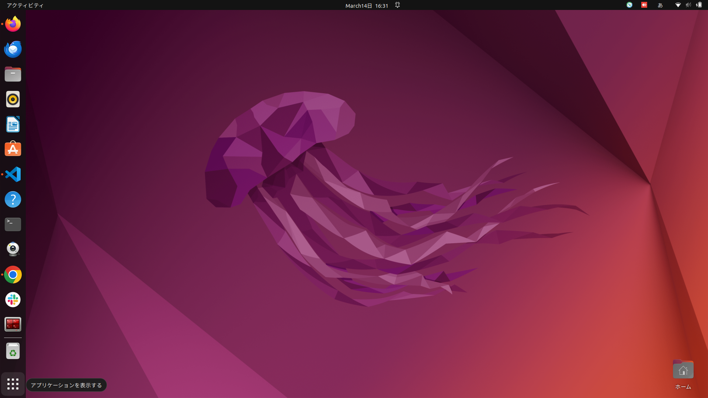

# SAM2_ROS2
## 概要

ROS2とSAM2を利用した水面検知プログラム

### 導入

1. ROS2humbleの導入

   [こちら](https://docs.ros.org/en/humble/Installation/Ubuntu-Install-Debs.html)を参考にROS2humble-desktopをインストール

2. realsenseの導入

   [こちら](https://github.com/IntelRealSense/librealsense/blob/master/doc/distribution_linux.md)を参考にインストールを行う

   * 公開鍵の登録

    ~~~ bash
    sudo mkdir -p /etc/apt/keyrings
    curl -sSf https://librealsense.intel.com/Debian/librealsense.pgp | sudo tee /etc/apt/keyrings/librealsense.pgp > /dev/null
    ~~~

   * サーバーをリポジトリリストへ登録

    ~~~ bash
    echo "deb [signed-by=/etc/apt/keyrings/librealsense.pgp] https://librealsense.intel.com/Debian/apt-repo `lsb_release -cs` main" | \
    sudo tee /etc/apt/sources.list.d/librealsense.list
    sudo apt-get update
    ~~~

   * ライブラリのインストール

    ~~~ bash
    sudo apt-get install librealsense2-dkms librealsense2-utils librealsense2-dev librealsense2-dbg
    ~~~

    ※インストールの際、下記画像のようなセキュアブートの設定を促される場合もあるので、その場合はパスワードを設定し、sudo rebootで再起動後に出る選択肢で設定を完了する必要がある

    

    * 動作確認

    ~~~bash
    realsense-viewer
    ~~~

3. realsense-rosの導入

   * ワークスペースの作成
    ※ワークスペースを既に作成している場合省略可

    ~~~ bash
    mkdir -p ~/ros2_ws/src
    cd ~/ros2_ws/src/
    ~~~

   * インストール

    ~~~ bash
    git clone https://github.com/IntelRealSense/realsense-ros.git -b ros2-master
    cd ~/ros2_ws
    export ROS_DISTRO=humble
    sudo apt-get install python3-rosdep -y
    sudo rosdep init # "sudo rosdep init --include-eol-distros" for Foxy and earlier
    rosdep update # "sudo rosdep update --include-eol-distros" for Foxy and earlier
    rosdep install -i --from-path src --rosdistro humble --skip-keys=librealsense2 -y
    ~~~

   * 依存環境の整理

    ~~~bash
    colcon build
    source /opt/ros/humble/setup.bash
    cd ~/ros2_ws
    . install/local_setup.bash
    ~~~

   * 動作確認

    ~~~bash
    source install/setup.bash
    ros2 launch realsense2_camera rs_launch.py
    ~~~

    realsenseのカメラ部が赤く光り、RealSense Node Is Up!がターミナルに出たら起動している
    Topicの内容(画像情報)はRvizなどで確認できる

4. Docker環境〜SAM2のインストール

* Dockerのインストール
  
  ※すでにインストールされている場合この過程は不要

  ~~~ bash
    sudo apt update
    sudo apt install ca-certificates curl gnupg

    sudo install -m 0755 -d /etc/apt/keyrings
    sudo curl -fsSL https://download.docker.com/linux/ubuntu/gpg -o /etc/apt/keyrings/docker.asc
    sudo chmod a+r /etc/apt/keyrings/docker.asc

    # Add the repository to Apt sources:
    echo \
      "deb [arch=$(dpkg --print-architecture) signed-by=/etc/apt/keyrings/docker.asc] https://download.docker.com/linux/ubuntu \
      $(. /etc/os-release && echo "$VERSION_CODENAME") stable" | \
      sudo tee /etc/apt/sources.list.d/docker.list > /dev/null
    sudo apt update

  ~~~

* Dockerグループ作成と登録
  
  必須では無いが,この過程を飛ばすとubuntu起動時にchmodで権限を与える必要が出てくる

  ~~~ bash
  sudo groupadd docker
  sudo usermod -aG docker <ユーザー名>
  ~~~

* Docker-composeのインストール
  
  ~~~ bash
  sudo apt install docker-compose
  ~~~

1.nvidiaドライバ及びnvidia-dockerのインストール(注意)

* アプリケーションを表示する → ソフトウェアとアップデートを開く
  
  

  

* ドライバを選択してインストール
  
  SAM2に対応しているCUDA12.0以上を導入可能なドライバをインストールする(図の例では535をインストール)
  ドライバは最新版より前のものをインストールするのがおすすめ

  

* 再起動
  
  ドライバインストール後、再起動
  
  ~~~ bash
  sudo reboot
  ~~~

  ドライバが正常にインストールされているか以下のコマンドで確認.

  ~~~ bash
  nvidia-smi
  ~~~

  

  上記の画面が表示されていればインストール成功

* nvidia-docker2のインストール
  
  dockerコンテナ内でnvidia環境を適用させるために下記のコマンドでインストールする

  ~~~ bash
  distribution=$(. /etc/os-release; echo $ID$VERSION_ID) && \
  curl -fsSL https://nvidia.github.io/libnvidia-container/gpgkey | \
   sudo gpg --dearmor -o /usr/share/keyrings/nvidia-container-toolkit-keyring.gpg && \
  curl -s -L https://nvidia.github.io/libnvidia-container/$distribution/libnvidia-container.list | \
   ed 's#deb https://#deb [signed-by=/usr/share/keyrings/nvidia-container-toolkit-keyring.gpg] https://#g' | \
   sudo tee /etc/apt/sources.list.d/nvidia-container-toolkit.list && \
  sudo apt update && \
  sudo apt install -y nvidia-docker2 && \
  sudo systemctl restart docker
  ~~~

2.SAM2とGroundingdino環境の構成

* [こちら](https://github.com/facebookresearch/sam2)よりSAM2リポジトリをクローン
  
  ~~~ bash
  git clone https://github.com/facebookresearch/sam2.git
  ~~~

* SAM2リポジトリ内に移動
  
  ~~~ bash
  cd sam2
  ~~~

* [こちら](https://github.com/IDEA-Research/GroundingDINO)よりGrounding DINOリポジトリを**SAM2リポジトリ内に**クローン(美しくないが、一旦放置)
  
  ~~~ bash
  git clone https://github.com/IDEA-Research/GroundingDINO.git
  ~~~

* SAM2リポジトリ内のdocker-composeファイルを削除しておく(gui上の処理でもOK)
  
  ~~~ bash
  rm docker-compose.yaml
  ~~~

* 本リポジトリをclone
  
   ~~~bash
   cd /work
   mkdir ros2_ws/src
   cd ros2_ws/src
   git clone  https://github.com/Taker064/SAM2_ROS2.git
   ~~~

* 本リポジトリ内のDockerディレクトリ内の中身をsam2リポジトリ内に移動(gui上で移動させてもOK)
  
  ~~~bash
  cd SAM2_ROS2/Docker
  mv Dockerfile docker-compose.yaml ../../../sam2
  ~~~

* sam2リポジトリ内でdocker-compose up
  
  ~~~
  cd ../../sam2
  docker-compose up
  ~~~
  
* Dockerコンテナを開く
  VScodeの拡張機能である**Remote Development**で開くことをおすすめする
  
  

  **Attach in New Windowで開くことが可能** (2回目以降は直接Attach in New WindowでOK)

  

* Dockerコンテナ内のworkディレクトリ内に移動
  **ここからはDockerコンテナ内の操作となる コンテナ内ではrootユーザーとなるためsudoコマンドが不要であり,さらにcdコマンドで/rootに戻ることに注意**
  
  ~~~bash
  cd ../work
  ~~~

  workディレクトリ内にホストPCのsam2リポジトリ及びGroundingDINOディレクトリが全て共有されており,ホストPCのsam2リポジトリに変更を加えるとコンテナ内のworkディレクトリに変更が共有される.

* checkpointkディレクトリでsam2のモデル設定ファイルをインストール
  
  ~~~ bash
  cd checkpoints
  ./download_ckpts.sh
  cd ../
  ~~~

* sam2/configs/sam2.1 ディレクトリ内のモデルの重みファイルをsam2直下に移動させる(GUI上の操作でもOK)
  
  ~~~ bash
  cd sam2/configs/sam2.1
  cp sam2.1_hiera_b+.yaml sam2.1_hiera_s.yaml sam2.1_hiera_t.yaml sam2.1_hiera_l.yaml ../..
  cd /work
  ~~~

* GroundingDINOディレクトリに移動
  
  ~~~ bash
  cd GroundingDINO
  ~~~

* CUDAの環境変数の設定
  
  **※この処理は必ず行うこと**
  
  ~~~ bash
  export CUDA_HOME=/usr/local/cuda-12
  echo 'export CUDA_HOME=/usr/local/cuda-12' >> /root/.bashrc
  ~~~

* 依存パッケージのインストール
  
  ~~~ bash
  pip install -e .
  ~~~

  この処理でエラーを吐いた場合、**pytorchの対応CUDAバージョンとコンテナ内のCUDAのバージョン(12.1)が合っていない**可能性があるので下記の処理でpytorchのバージョンを変更しておく

  ~~~ bash
  pip install torch==2.5.1 torchvision==0.20.1 torchaudio==2.5.1 --index-url https://download.pytorch.org/whl/cu121 
  ~~~

* 事前学習済みの重みファイルをインストールする
  
  ~~~ bash
  mkdir weights
  cd weights
  wget -q https://github.com/IDEA-Research/GroundingDINO/releases/download/v0.1.0-alpha/groundingdino_swint_ogc.pth
  cd ..
  ~~~

5. Docker環境内へのROS2環境導入
   [こちら](https://docs.ros.org/en/humble/Installation/Ubuntu-Install-Debs.html)を参考にコンテナ内にROS2humble-desktopをインストール

### プログラム概要

1. プログラムの説明

   * sam2test.py:画像動機・条件指定なしのシンプルなプログラム.case1とほぼ同じ

2. 動作方法

   * ホストPCのターミナル内でrealsenseもしくはrosbagデータを起動

   ~~~bash
   source realsense_ws/install/local_setup.bash 
   ros2 launch realsense2_camera rs_launch.py
   もしくは
   ros2 bag play <再生したいrosbagディレクトリ>
   ~~~

   * dockerコンテナ内のターミナルでプログラム起動

    ~~~bash
    cd /work/ros2_ws
    source install/setup.bash
    ros2 run sam2_rostest sam2_sift_depth.py
    ~~~

   * rvizで/testトピックを閲覧する

    ~~~bash
    rviz2
    ~~~

3. 今後の方針

   SAM2での水面検知→Topic送信はできるようになったので,ロボットに搭載してトピックの条法を利用してロボットの制御ができるようになってほしい(マップに情報追加など)